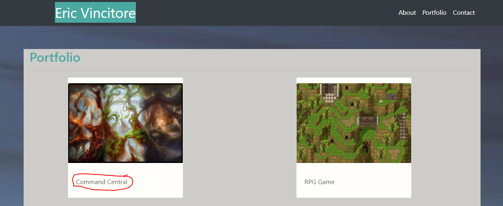

# Eric Vincitore

## Introduction
Hello! Im Eric Vincitore, a highly motivated and team oriented developer. I am alway focused on the success of the projects I work on and the team I work with. No task is too large or small to take on.

"It still holds true that man is most uniquely human when he turns obstacles into opportunities."  
- Eric Hoffer

## Portfolio  

Navigate through the portfolio pages with the tabs in the upper right corner of the page.  

### About  
Find out more about Eric by reading his introduction on the about page.  

### Portfolio
See the different projects Eric has worked on and completed on the Portfolio page.  

* To see different projects click the title of the project you are looking to explore or navigate to Eric's Git-Hub page using the following link.  

* Git-Hub Page  
https://github.com/EricVincitore  

* Portfolio Page  

### Contact Page
Connect with Eric by filling out the contact form on the Contact page. Once submit is clicked the email will generate into teh default email program the user has set up and final edits can be made in the platform.

## Links

### Deployed Portfolio Page
 
https://ericvincitore.github.io/Bootstrap-Portfolio/

### Git-Hub Page

https://github.com/EricVincitore/Bootstrap-Portfolio

## Technologies Used

* HTML5
* Bootstrap
* Javascript

## Development Role

This app was developed by Eric Vincitore.
